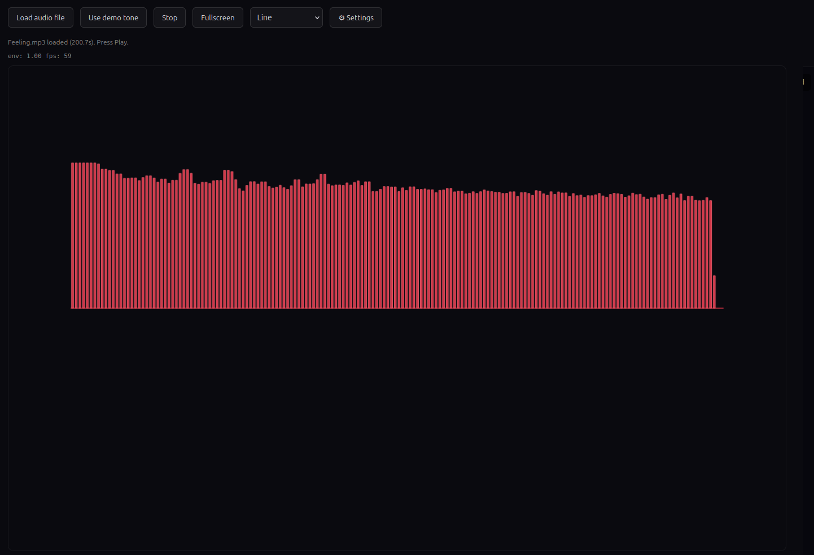
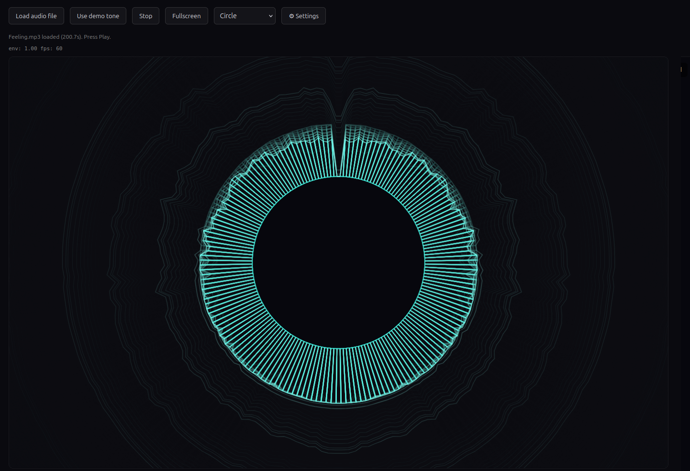
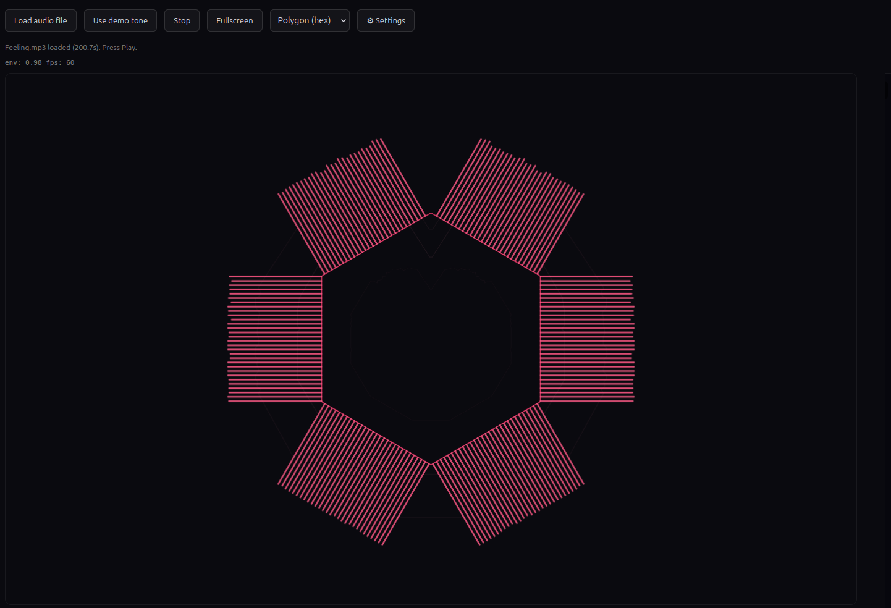
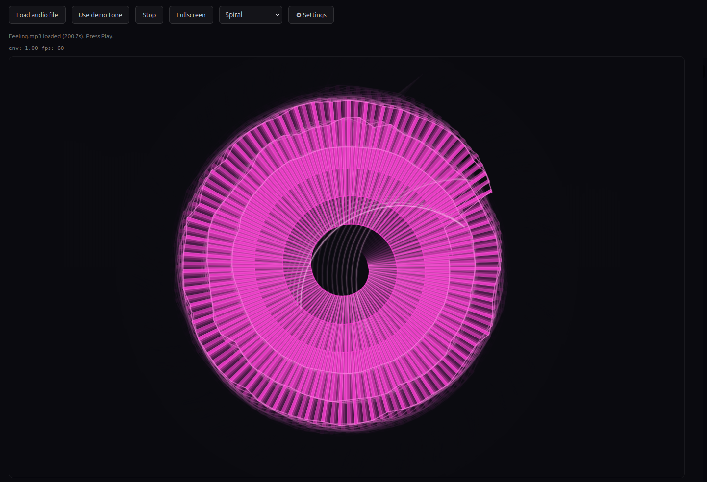
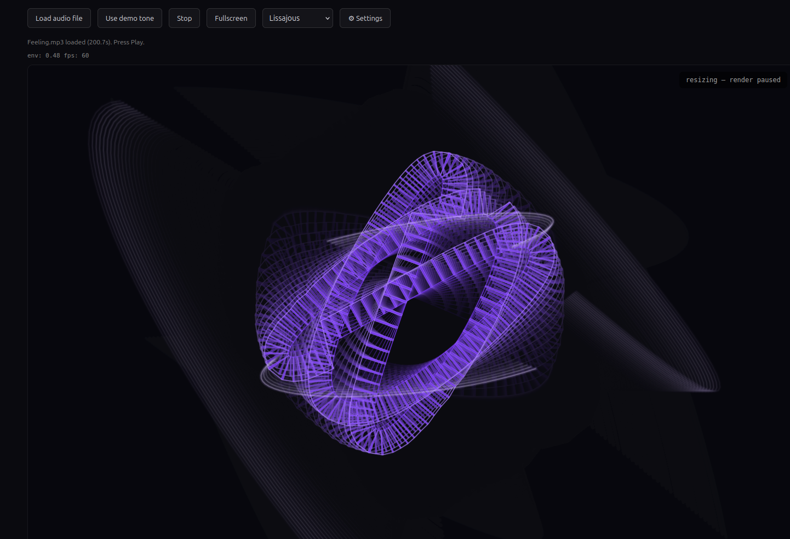

# Spectrogram Path Visualizer

A real-time, browser-based audio visualization that maps frequency content onto five different geometric paths, each with its own characterized visual identity and event detection.

It's a single-page app — no build step, no server, no dependencies. Just three files: `visualizer.html`, `visualizer.css`, `visualizer.js`. Drop them into a folder and open the HTML file in any modern browser.

## What it does

Plays an audio file (or a built-in demo tone) and renders a live visualization of its frequency content. The visualization isn't a generic spectrum — each of the five available "paths" reads the audio differently and shows different musical features:

- **Line** — a flat spectrogram readout, useful as a reference. No detectors, no decoration.
- **Circle** — a pulsing solar corona. Slim wedge bars distributed around a circle, with high-frequency events triggering radial pulses that expand outward across the canvas.
- **Polygon (hex)** — heroic and architectural. Big wedge bars on a hexagon, with kick drum hits triggering pulses that collapse inward through the figure.
- **Spiral** — a glowing rotating disc. Spiral path that spins faster when the audio is more energetic, with snare and hi-hat hits flinging "tail flicks" off the outer end of the spiral, like sparks off a turning wheel.
- **Lissajous** — a 3D-feeling figure-8 that rotates and breathes with the bass register. Bass register changes (like the chord progressions of a track or the moment of a drop) trigger "torus halo" pulses that eject from the figure's two lobes.

Each path has its own default settings that have been tuned to feel right with that geometry — switching paths gives you a complete, different visualization.

## Running it

1. Put `visualizer.html`, `visualizer.css`, and `visualizer.js` in the same folder.
2. Open `visualizer.html` in a modern browser (Chrome, Firefox, Safari, Edge).
3. Click "Load audio file" and pick an audio file (mp3, wav, m4a, ogg, etc.). Or click "Use demo tone" to use a built-in demo oscillator instead.
4. Click "Play".
5. Use the path selector to switch between visualizations.
6. Click "Fullscreen" for the immersive view.

The "⚙ Settings" button reveals advanced controls (Trail, Envelope, Pulses, and tuning sliders). These auto-reset to the current path's defaults when you switch paths. Use the "Reset" button inside the settings panel to revert tweaks for the currently selected path.

## Path details

### Line — Diagnostic Readout

The honest spectrogram. Frequency bins map to horizontal positions; bar heights show magnitude. No envelope, no pulses, no trail. Useful as a reference to see what's actually in the audio.

### Circle — Sun Corona

Slim bars distributed around a circle. The path itself is the audio's "rest state"; bars push outward on every frame to show current frequency content. High-frequency events (cymbals, sibilance, hi-hats above ~4kHz) trigger pulses that expand from the circle's edge outward across the canvas. The detection has low sensitivity, which means the refractory period itself acts as a metronome on busy treble — pulses fire on the strongest hits and skip the rest.

### Polygon (hex) — Kick-Driven Architecture

Heavy bars on the six edges of a hexagon. Kick drum hits trigger the entire hexagon-as-snapshot to collapse inward through the canvas center, producing a "drumhead" pulse that reads as the kick visually. Uses log-mel onset strength on the bass band (43-301Hz), peak-picked with a refractory window so it locks to the actual drum pattern.

### Spiral — Spinning Wheel With Sparks

A spiral that spins, with rotation velocity driven by the audio's running envelope. When the music is energetic the spiral spins fast; in silence it slows to a halt. Snare and hi-hat hits are detected via log-mel onset on the upper-mid band (170Hz-5.5kHz) and trigger "tail flicks" — the outer 12% of the spiral is captured as a snapshot and ejected, with rigid-body translation along the tangent at the moment of release plus rotational momentum from the spinning motion. Faster spin = farther throw, like a centrifuge releasing material.

### Lissajous — Compositional Phase Detector

A 3:2 figure-8 that rotates to an angle determined by the current bass note's register, and breathes (expands as it's held longer). When the bass changes register — typically at chord changes, drops, and structural transitions — the figure ejects two arcs from its lobes perpendicular to its rotation axis. These "torus halos" expand laterally as they travel outward, peak in brightness as they would close the figure's openings, then fade.

What's interesting about this one: the detection criteria (stable peak, prominence, whole-tone quantization, hysteresis, lock duration) end up only firing on *compositionally significant* changes — so the lissajous reads music's structural hierarchy more than its bass line. It catches drops, phrase boundaries, and chord changes. With a trail effect enabled, the rotational history of the figure persists as a 3D-feeling tornado of past states.

## Defaults

Each path has a complete profile that gets applied automatically when you switch:

| Path | Trail | Envelope | Pulses | Sens | Bar | Reach | Gain | Mix | Curve | Morph |
|------|-------|----------|--------|------|-----|-------|------|-----|-------|-------|
| Line | off | off | off | 1.0 | 0.55 | 0.30 | 1.0 | 0.95 | 0.45 | 0.6 |
| Circle | off | on | on | 0.4 | 0.15 | 0.15 | 0.7 | 0 | 0.4 | 0.6 |
| Lissajous | on | on | on | 1.4 | 0.15 | 0.15 | 0.7 | 0 | 0.4 | 0.6 |
| Spiral | on | on | on | 1.4 | 0.40 | 0.25 | 1.2 | 0 | 0.4 | 0.6 |
| Polygon | off | off | on | 1.4 | 0.45 | 0.40 | 1.5 | 0 | 0.4 | 0.6 |

These are baked into the JS file in the `PATH_DEFAULTS` object. Edit there to change them.

## Browser support

Anything modern. Uses standard WebAudio API (`AudioContext`, `AnalyserNode`) and Canvas2D. Tested in current Chrome and Firefox. No WebGL, no service workers, no module imports.

## Files

- `visualizer.html` — markup and control surface
- `visualizer.css` — minimal dark-theme styling
- `visualizer.js` — all the audio analysis and rendering logic

For implementation details, see `ARCHITECTURE.md`.
